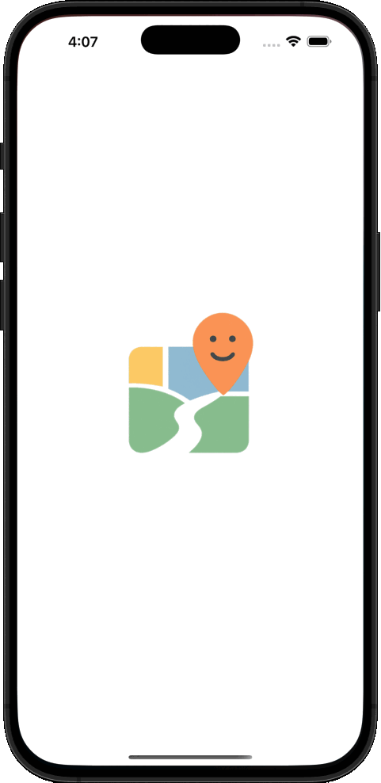
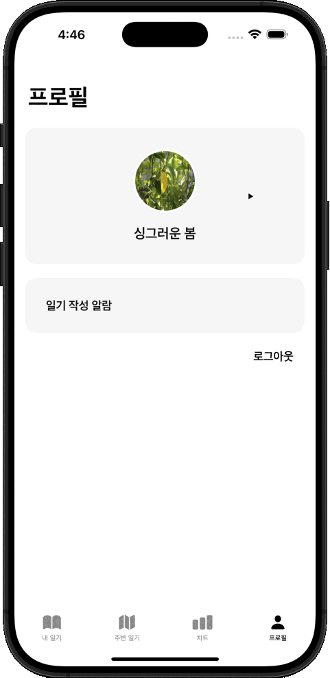

# 무드 맵

> 무드 맵은 일기 앱으로 2020년 수행한 ‘[일일 감정 다이어리](#이전-프로젝트)’ 프로젝트의 리팩토링 버전입니다. 일기라는 기본적인 컨셉을 제외하고 많은 부분들을 개선하여 관련한 종합적인 정보를 제공합니다.

## 목록

- [리팩토링 개요](#리팩토링-개요)
- [기능 개선 및 서비스 흐름 변화](#기능-개선-및-서비스-흐름-변화)
- [아키텍처 개선](#아키텍처-개선)
- [E-R Diagram](#e-r-diagram)
- [시스템 구조도](#시스템-구조도)
- [개발 환경](#개발-환경)
- [프로젝트 회고](#프로젝트-회고)
- [이전 프로젝트](#이전-프로젝트)
- [코드 비교](#코드-비교)
- [연락처](#연락처)

---

## 리팩토링 개요

  

#### 기존 MVC 구조를 모바일 환경에 적합한 MVVM 구조로 리팩토링

- 프로젝트 수준을 고려한 Clean Architecture 및 DDD 접목
- 프로그래밍 패러다임 전환에 따른 UIKit + SwiftUI 통합 적용

#### AI 페어 프로그래밍을 통한 개발 영역 확장 및 SDLC 이해

- AI 페어 프로그래밍 생산성으로 모바일로부터 서버 도메인까지 확장된 SDLC 이해
- AWS 프리티어 만료, 미사용 저전력 PC를 활용한 물리 서버 구성으로 비용 절감
- 가상화 레이어를 활용해 도메인 분리하여 유지보수성 및 확장성 확보
- 클라이언트는 보안 도메인에만 접근하며 인증/인가 과정을 거쳐 필요한 리소스 요청 및 획득

---

## 기능 개선 및 서비스 흐름 변화

#### 사용자 위치 중심 일기에서 장소 중심 일기 서비스로 개선

  

- 기존 서비스는 사용자 주변 다른 사용자의 위치를 추적하여 작성한 일기들을 열람하는 방식
- 일기의 공개 여부는 사용자가 설정하지만, 실시간 위치가 의도치 않게 노출될 수 있어 개인정보 침해 우려가 있었음
- 사용자가 특정 장소에 대해 느낌을 기록하는 방식으로 일기 작성하여 마음의 지도를 그려나가는 컨셉으로 개선
- 주변 장소를 중심으로 익명 작성된 일기들을 열람할 수 있도록 하여 개인정보침해 우려 개선
- 기술적으로는 단순 현 위치 기반 정보조회에서 검색 또는 지도에서 위치 선택을 통한 정보조회도 가능하도록 개선

#### Push Notification 활용 리액션 기능 추가

  

- Push Notification을 통해 일기에 간단한 공감 리액션 기능을 추가
- 사용자 간 상호작용을 통해 인앱 유입률 및 사용률 증가 유도

#### JWT 중심 로그인 및 회원관리

  

- 기존 ID, PW 로그인 방식에서 JWT 중심 로그인 및 회원관리 채택
- 사용자가 별도의 비밀번호를 기억할 필요없이 이메일을 PK로 로그인
- 현재 이메일 인증코드 발송을 통한 사용자 검증 방식 제공
- 추후 애플, 구글 등의 통합 로그인 적용 시 확장성 고려 설계됨

#### 개선된 일기 작성 알림

  

- 기존 일기 작성 알림은 시간만 설정이 가능했고 하나의 알림만 설정 가능했음
- 개선된 알림 기능은 시간, 요일 등 복잡한 설정이 가능하며 다중 알림을 등록할 수 있도록 개선

---

## 아키텍처 개선

  

#### MVC -> MVVM + Clean Architecture + DDD

- 기존 프로젝트는 ViewController에 비즈니스 로직이 뒤섞인 단순한 MVC 구조
- 현재 프로젝트는 iOS 모바일 환경에 적합한 MVVM 구조 채택
- Clean Architecture 원칙에 따라 계층을 구분
- DDD의 도메인 중심 설계 철학을 반영하되, 앱 규모에 적합한 관심사 분리로 유연하게 적용

#### SceneCoordinator 기반 UIKit, SwiftUI 통합 화면 라우팅

- UIKit에서 SwiftUI 전환기임을 고려한 UIKit에 SwiftUI 통합 구조 설계
- SwiftUI를 HostingController로 래핑하여 UIKit에 통합
- SceneCoordinator 활용 TabBar, Navigation Stack 관리
- UIKit 대응 Rx, SwiftUI 대응 Combine 활용 동시성 프로그래밍

---

## E-R Diagram

  

- User, Diary, Emotion, Reaction, File, Device 엔티티로 구성된 E-R Diagram

---

## 시스템 구조도

  

#### 시스템 구성

- 물리 하드웨어 구성
  - AWS 프리티어 만료로 개인 프로젝트에서 불필요한 비용 발생
  - 서버 비용 절감을 위해 소유한 저전력 Intel PC와 m1 Mac을 활용한 물리 서버 구성
  - 운영 시스템과 CICD 시스템을 물리적으로 분리하여 운영 안정성과 배포 유연성 확보
- 가상화 레이어를 활용한 도메인 및 컨테이너 구성
  - 제한적인 물리 하드웨어 사용으로 각 서버 도메인 분리 전략 필요
  - Virtual Box VM을 통한 하드웨어 수준의 도메인 분리 시도
  - 제한된 성능으로 인해 Docker 컨테이너로만 분리하는 안으로 절충
  - 단 Docker 네트워크와 프록시 구성을 통한 내외부 도메인 간 망분리
  - 운영 서버는 보안, 애플리케이션, 스토리지 그룹의 도메인으로 분리 구성
  - 도메인 내 Docker 및 Dockerfile 구성으로 주요 컨테이너를 분리하여 유지보수성과 확장성 확보

#### 도메인 세분화

- 보안 레이어 구성
  - 보안 도메인은 클라이언트 요청을 애플리케이션 도메인으로 리다이렉트
  - 클라이언트는 보안 도메인에만 접근하며 인증 과정을 거쳐 필요한 리소스를 요청하고 획득
  - Nginx를 이용한 프록시 서버 구성
  - Let's Encrypt 무료 공인 Https 보안 프로토콜 적용하여 보안 강화
- 애플리케이션 레이어 구성
  - Spring Boot를 이용한 RESTful API 서버 구성
    - JWT 기반 인증, 회원 정보 관리, 공유 다이어리 정보 관리, Push Notification 처리 등
  - 클라이언트가 요청한 비즈니스 로직을 수행하며 스토리지 도메인 그룹과 상호작용
- 스토리지 레이어 구성
  - DB: MariaDB를 이용 정형 데이터 저장
  - IMDB: Redis를 이용 임시 인증 정보, JWT 블랙 관리 등
  - Static Storage: MinIO를 이용 사용자 파일 업로드 및 다운로드
- CI/CD 파이프라인 구성
  - 서버 애플리케이션은 Jenkins + Git Webhook을 이용 코드 변경 감지 후 Dockerfile 기반 컨테이너 빌드 및 서버 배포
  - iOS 애플리케이션은 Fastlane + Match를 이용하여 Git 저장소에서 인증서 및 프로비저닝 프로파일 관리
  - TestFlight를 통해 iOS 애플리케이션 빌드/배포 및 여부 알림

---

## 개발 환경

#### 공통

- 개발 PC
  - MacBook Air M1, 2020 macOS Sequoia 15.1.1(24B91)

#### iOS 애플리케이션 개발

- Minimum Deployments
  - iOS 16.0
- IDE
  - Xcode 16.3: 코드 편집, 빌드/배포
  - VSCode 1.96.2: 코드 편집, Copilot 연동 AI 어시스트
  - swiftlint 0.55.1: 코드 린트
  - swift-format 510.1.0: 코드 포매팅
  - CocoaPods: 1.16.2: 의존성 관리
  - ruby 2.7.5p203: 의존성 관리
- Language
  - Swift 5
- Framework
  - UIKit
  - SwiftUI
  - Combine
- Core Library
  - ReactiveX 6.6.0 (RxSwift, RxCocoa, RxAlamofire, Action)
  - Alamofire
  - KeychainAccess
  - FSCalendar
  - RealmSwift
  - Firebase (Crashlytics, Messaging)
- CI/CD
  - [개발/운영 타겟 분리 -> Git -> Fastlane + Match -> TestFlight -> 빌드/배포 여부 알림]

#### 웹 애플리케이션 개발

- IDE
  - IntelliJ IDEA 2024.1.2: 코드 편집, 빌드/배포, Copilot 연동 AI 어시스트
  - SonarQube for IDE 10.19.80823: 코드 린트
  - CheckStyle-IDEA 5.103.0: 코드 포매팅
- Language
  - Java 17
- Framework
  - Spring Boot 3.2.5
  - Spring Web
  - Spring Security
  - Spring Data JPA
  - Spring Data Redis
  - Spring Boot Mail
  - Spring Boot Thymeleaf
- Core Library
  - MariaDB JDBC Driver 2.7.2
  - Lombok 1.18.26
  - JJWT 0.11.5
  - Bucket4j 8.13.0
  - Firebase Admin SDK 9.3.0
  - MinIO SDK 8.4.3
- CI/CD
  - [개발/운영 빌드 분리 -> Git -> Jenkins + Webhook -> Docker 기반 운영 서버 -> 빌드/배포 여부 알림]

#### 인프라스트럭처

- 서버 구성
  - 물리 시스템 스펙
    - 운영 시스템
      - Server: Lenovo ThinkCentre M72e (Intel Core i3-3220T, RAM 8GB)
      - Host OS: Ubuntu 24.04.2 LTS
    - CICD 시스템
      - Server: Apple MacBook Air M1, 2020 (Apple M1, RAM 16GB)
      - Host OS: macOS Sequoia 15.1.1(24B91)
  - 도메인 분리 구조
    - 보안 프로토콜 관리 (Host OS)
      - TLS(SSL): Let's Encrypt
    - 보안 도메인 (Docker Container)
      - Proxy: nginx:stable-alpine3.19
    - 애플리케이션 도메인 (Docker Container)
      - Spring Boot: gcr.io/distroless/java17-debian11
    - 스토리지 도메인 (Docker Container)
      - RDB: mariadb:10.11
      - IMDB: redis:alpine
      - Static Storage: minio/minio:latest
    - CICD 도메인 (Docker Container)
      - CICD: jenkins/jenkins:2.457-jdk17

---

## 프로젝트 회고

#### 아키텍처 설계의 꽃 Divide and Conquer

- 아키텍처 설계의 이점으로 의존성 분리를 통한 재사용성, 테스트 용이성 등이 거론됨
- 몸소 겪었던 가장 큰 경험은 Divide and Conquer 과정으로 복잡한 문제를 잘게 쪼개는 행위 그 자체에 깊은 감명을 받게 됨
- 거대한 프로젝트를 맥락적으로 이해하고 계층과 그룹으로 분리했을 때 한 부분은 작은 부분이 되기에 이해와 몰입이 가능해짐
- 약 5년전 ViewController에 과중한 책임을 부여하던 나를 회상하면 도대체 무엇을 하고 있던 것인지 항상 모호하고 답답했음
- 과거의 나에 비하면 현재는 전체와 부분을 오가며 그것들을 이해 가능의 영역으로 만들 수 있게 되었음

#### 세련된 SwiftUI와 Combine

- SwiftUI는 UIKit 대비 심플한 코드 몇줄로 완성된 UI 컴포넌트를 다룰 수 있으며 코드 변경 즉시 변경 사항을 눈으로 확인 가능
- 개발자가 어떻게 구현할지보다 무엇을 구현할지에 더욱 집중할 수 있도록 현대적인 프로그래밍 패러다임을 잘 반영
- 기존 UIKit 역시 Rx 라이브러리를 통해 데이터 바인딩을 했고 책임 분리가 가능했음
- Combine의 경우 @State, @Binding, @ObservedObject 등 간단한 속성을 통해 데이터 바인딩을 보다 쉽게 처리할 수 있음

#### 지도 구현 사례로 본 UIKit, SwiftUI의 상호 보완성

- SwiftUI를 통한 지도 구현은 아주 간단하게 지도 위에 사용자의 위치를 표현할 수 있게 함
- 그러나 지도 상에서 맵핀의 위치를 조정하는 일은 몇줄의 코드로 간단히 처리할 수 없었고 UIKit을 통해 구현할 수 있었음
- SwiftUI와 UIKit은 상호보완적인 관계로 목적에 따른 접근 방법을 배울 수 있었음

## 끝맺음

#### 좁은 시야에서 더 넓은 시야로

- ChatGPT, Copilot과 함께 프로젝트를 수행
- GPT와 프로젝트 구조를 만들었고 Copilot을 통해 반복 코드와 단위 테스트를 구성
- AI 이전의 나는 코드 한 줄을 작성하려고 스택 오버플로우를 붙잡고 머리를 쥐어짜며 헤매야 했음
- 지금은 코드보다 프로젝트의 전역적 설계와 사용자 경험에 더 많은 집중을 할 수 있게됨
- 덕분에 코드 작성자에서 iOS 설계, 서버 도메인을 넘어 프로젝트 전역적 이해로 사고가 확장됨을 느낌

---

## 이전 프로젝트

**무드 맵**의 원본 프로젝트인 **일일 감정 다이어리**를 포함한 이전 프로젝트가 궁금하시다면 [여기를 눌러 확인](./assets/docs/portfolio-2020.md)하세요.

\* 이력서에 기재된 업무 프로젝트는 고객사 보안 정책에 따라 폐쇄적인 환경에서 수행되었습니다. 정보의 수집 및 공개 불가 방침에 따라 공개 가능한 비업무 프로젝트로 대체합니다.

---

## 코드 비교

**무드 맵**과 **일일 감정 다이어리**의 [다이어리 기능 일부 코드](./new-old-code-comparison)를 참조할 수 있도록 공개했습니다.

---

## 연락처

- Project Manager: Chaeho Jeong
- Email: chaehojeong@naver.com
